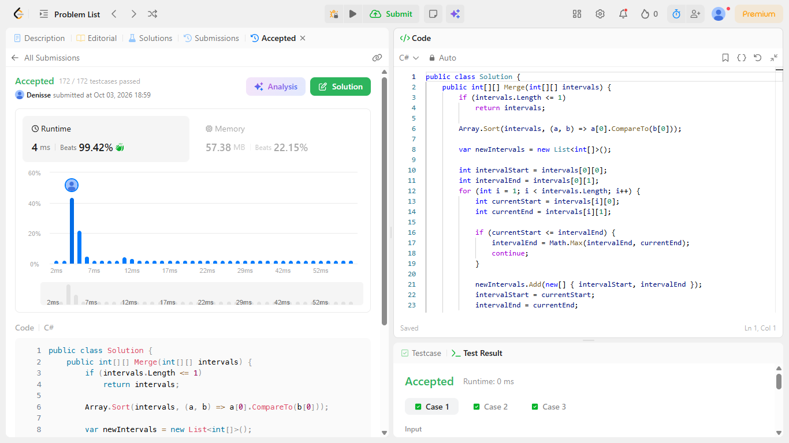
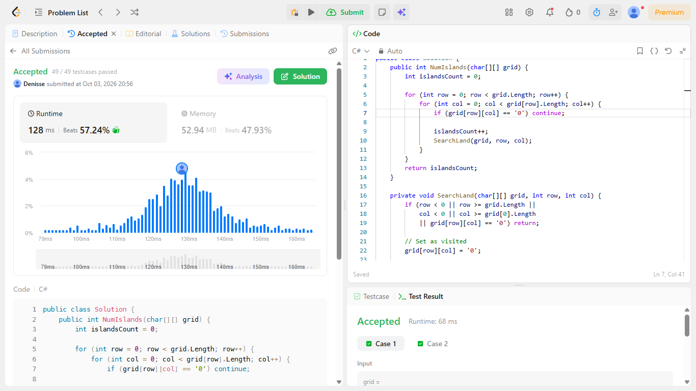
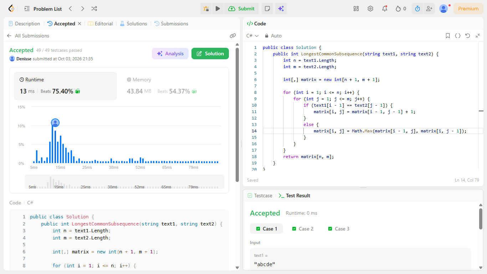
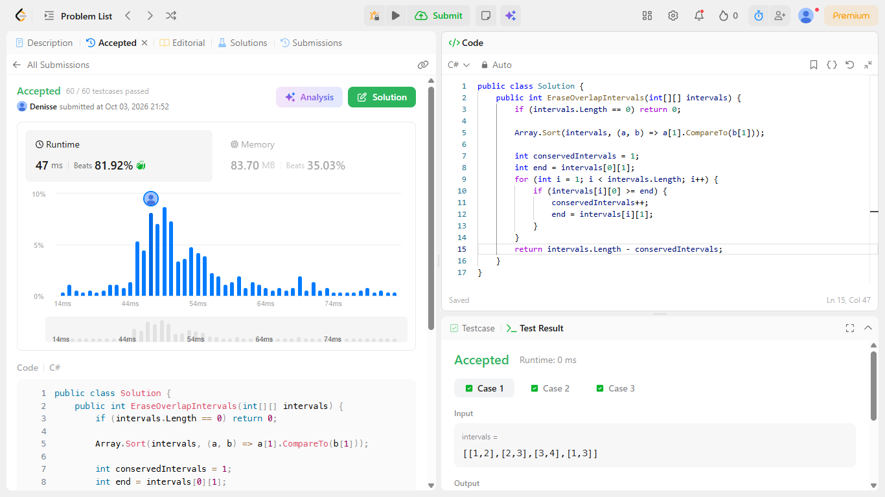
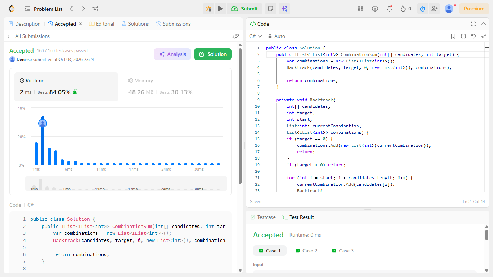

[Merge Intervals](https://leetcode.com/problems/merge-intervals/description/)

Familia: ordenamiento  
Idea: Se ordenan los intervalos por su inicio. Se mantiene el intervalo fusionado actual y, si el siguiente comienza antes o exactamente cuando termina el actual, se fusionan tomando el mayor final. Si no se solapan, se guarda el intervalo actual y se comienza uno nuevo.
Tiempo: O(n log n), donde n es la cantidad de intervalos, debido al ordenamiento.
Espacio: O(n) para almacenar el resultado de los intervalos fusionados.

[Number of islands](https://leetcode.com/problems/number-of-islands/description/)

Familia: Grafos
Idea: Cada celda de tierra ('1') representa un nodo y sus vecinos en las cuatro direcciones representan las conexiones. Cada vez que se encuentra una tierra no visitada, se inicia un DFS que recorre y marca toda la isla, aumentando el contador una sola vez.
Tiempo: O(m n), donde m es el número de filas y n el número de columnas. Cada celda se visita como máximo una vez.
Espacio: O(m n) en el peor caso.

[Longest Common Subsequence](https://leetcode.com/problems/longest-common-subsequence/description/)

Familia: Programación dinámica
Idea: Se utiliza una matriz dp[i,j] donde cada posición representa la longitud de la LCS entre los primeros i caracteres de text1 y los primeros j caracteres de text2. Si los caracteres coinciden, se toma la diagonal más uno; si no coinciden, se conserva el máximo entre eliminar el carácter de una cadena o de la otra.
Tiempo: O(n m), donde n es la longitud de text1 y m la longitud de text2.
Espacio: O(n m) para almacenar la matriz dp.

[Non-overlapping Intervals](https://leetcode.com/problems/non-overlapping-intervals/description/)

Familia: Greedy
Idea: Se ordenan los intervalos por su tiempo de finalización y se conserva siempre el siguiente intervalo que empiece después o exactamente cuando termina el último aceptado. Elegir el intervalo que termina antes deja la mayor cantidad de espacio para los siguientes; la cantidad eliminada es n cantidad de intervalos conservados.
Tiempo: O(n log n), donde n es la cantidad de intervalos, debido al ordenamiento.
Espacio: O(1) de espacio extra al ordenar in-place.

[Combination sum](https://leetcode.com/problems/combination-sum/description/)

Familia: Backtracking
Idea: Se construye una combinación progresivamente agregando un candidato a current. El candidato puede reutilizarse manteniendo el mismo índice, y al terminar una rama se elimina el último elemento para deshacer la elección y probar otra posibilidad. El índice start evita generar permutaciones repetidas.
Tiempo: Exponencial en el peor caso, debido a que se deben explorar y enumerar las posibles combinaciones. Una cota aproximada es O(n^(t/min)), donde n es la cantidad de candidatos, t es el target.
Espacio: O(t/min) para la profundidad máxima de la recursión y la combinación actual, sin contar el espacio necesario para almacenar las combinaciones de la respuesta.

