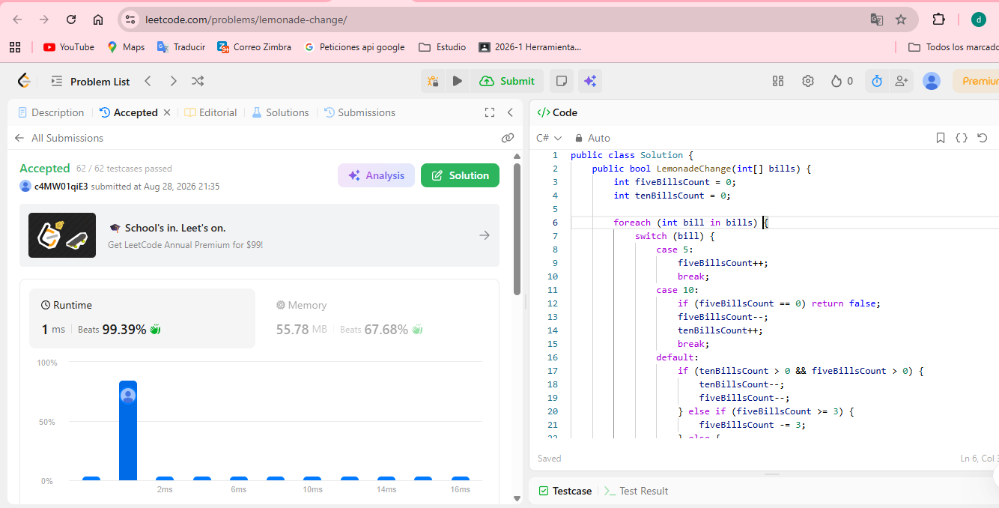
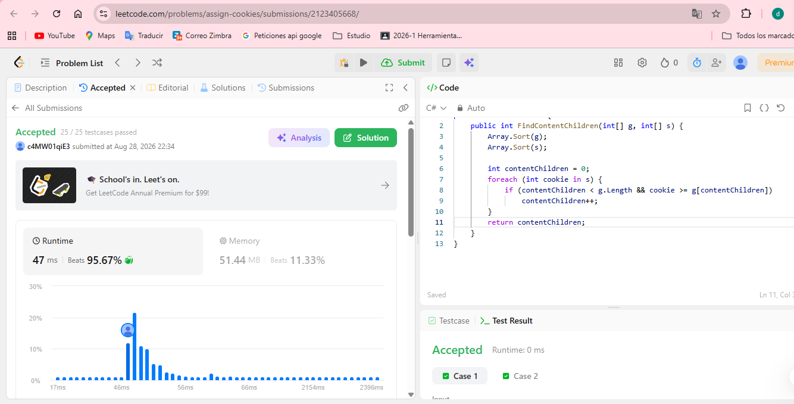

Ejercicio 1
[Lemonade Change](https://leetcode.com/problems/lemonade-change/)

Criterio greedy: Usar un billete de 10 y uno de 5 antes que usar tres billetes de 5
complejidad de tiempo y de espacio: O(1)

Ejercicio 2
[Lemonade Change](https://leetcode.com/problems/assign-cookies/)

Criterio greedy: Ordenar todo ascendentemente, reservando galletas más grandes para niños con mayor codicia
complejidad de tiempo y de espacio: O(n log n) - O(n log n + m log m)

